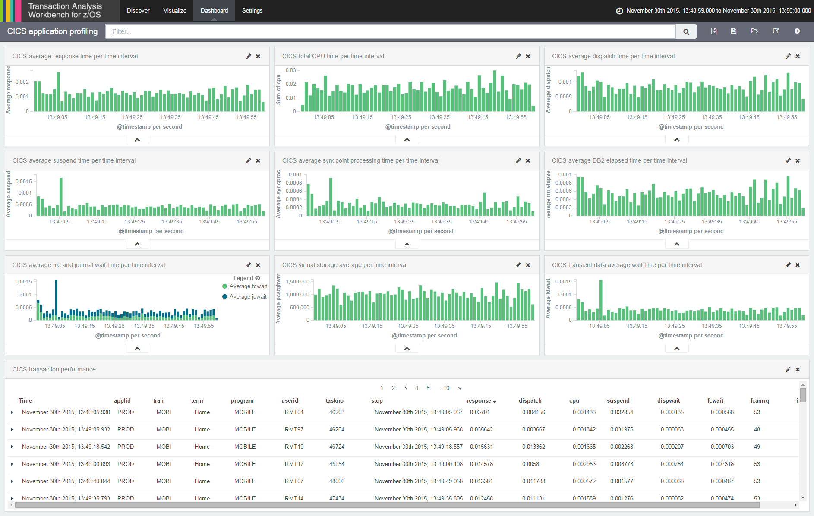
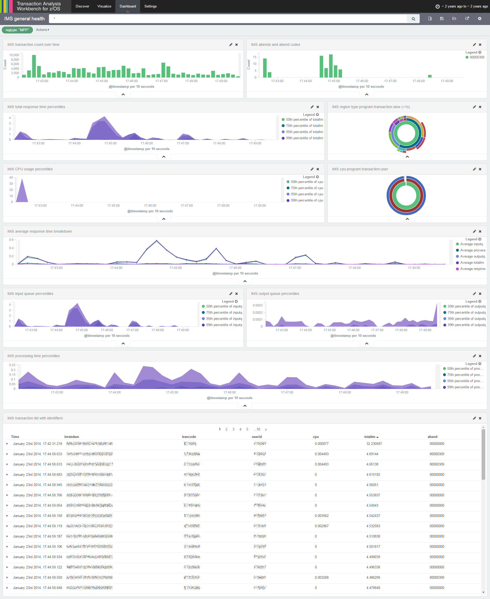
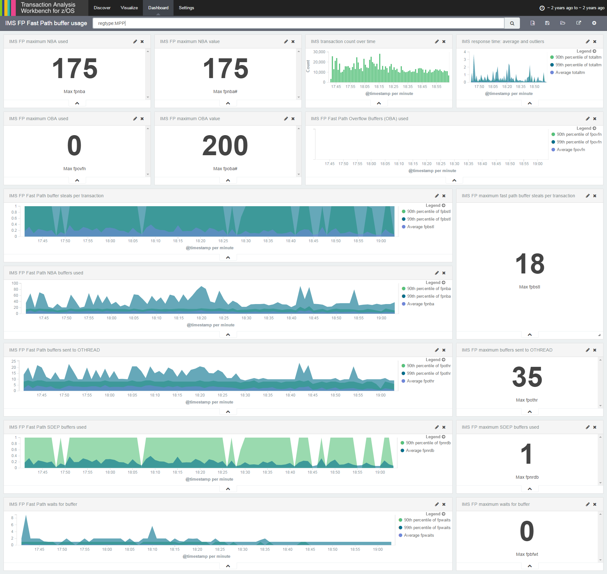

# z/OS log analysis in Kibana

This repository contains [Kibana](https://www.elastic.co/products/kibana)
dashboards for analyzing operations logs from IBM z/OS mainframes.

The operations logs consist of various record types, including SMF records.

The dashboards analyze operations logs from the following z/OS subsystems:

* CICS
* IMS
* Coming soon: IMS Connect with z/OS Connect

Note: This readme shows screen captures of CICS and IMS dashboards; however,
the repository currently only contains the definitions for the CICS dashboard.
The corresponding definitions for the IMS dashboards will be added in the next
few days.

To get the data for these dashboards from z/OS into Elasticsearch,
we used [IBM Transaction Analysis Workbench for z/OS](http://www.ibm.com/support/knowledgecenter/SSKKZM)
("Workbench"; the IBM product prefix for Workbench is FUW, hence the repository name prefix "fuw").

## Who we are

[Fundi Software](http://www.fundi.com/) develops Workbench.

## Disclaimer

This repository is not supported by IBM.

## Requirements

To use the dashboards, you will need the Elastic Stack:

- Kibana 4.1.0 or later
- Elasticsearch
- Logstash

To extract data from z/OS for use with the dashboards, you will need:

- IBM Transaction Analysis Workbench for z/OS, V1.3

For details on using Workbench to get data from z/OS into Elasticsearch, see the
[Workbench product documentation](http://www.ibm.com/support/knowledgecenter/SSKKZM_1.3.0/fuwutsk_big_data_logstash.dita).

## Installation

To load the dashboards into Kibana, run the included `load` script.

The `load` script loads the dashboards, and their related visualizations and
searches, from the JSON files in the `dashboards` folder.

On Unix, run the `load.sh` shell script:

```console
./load.sh
```

On Windows, run the `load.ps1` PowerShell script:

```console
.\load.ps1
```

By default, the `load` script loads the dashboards into the Elasticsearch instance at the URL http://localhost:9200,
with no HTTP authentication.

To specify a different URL or HTTP authentication credentials, use command-line parameters.

On Unix:

```console
./load.sh -url "http://hostname:9200" -user "admin:secret"
```

On Windows:

```console
.\load.ps1 -url "http://hostname:9200" -user "admin:secret"
```

## Screenshots

### CICS application profiling dashboard

  

This dashboard provides insights into delays in CICS transaction processing.

This dashboard presents data from CICS monitoring facility (CMF) performance class records
(SMF type 110, subtype 1, class 3).

This dashboard refers to the index pattern `fuw-cics-*`. If you have indexed CMF data to a different index pattern, edit the following searches to refer to that pattern:

- CICS
- CICS transaction performance

### IMS general health

  

This dashboard presents data from IMS log records.

### IMS Fast Path buffer usage

  

This dashboard presents data from IMS log records specific to Fast Path buffer usage.

## Acknowledgments

With thanks to [Elastic](https://www.elastic.co/), this repository reuses portions of
[elastic/beats-dashboards](https://github.com/elastic/beats-dashboards).